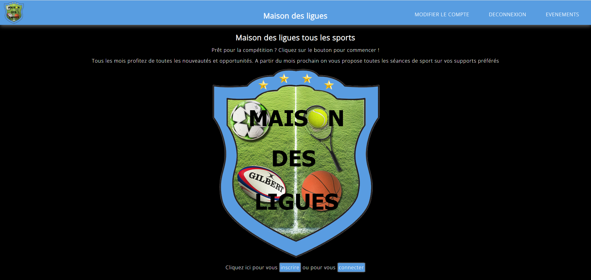
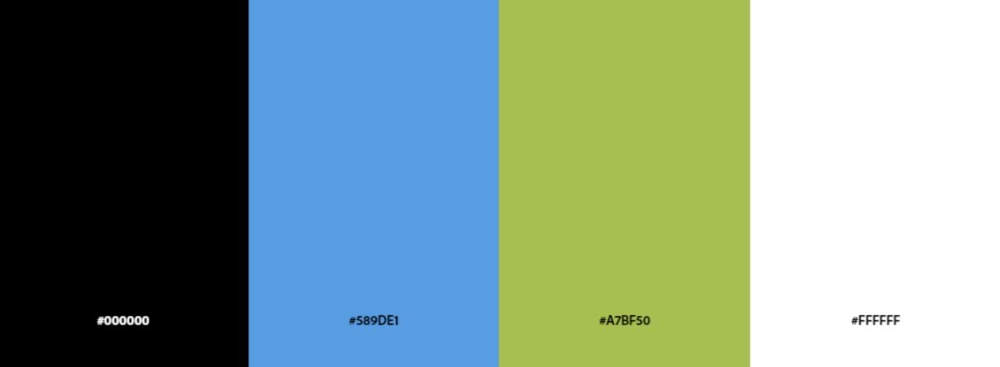

# Maison des Ligues
La maison des ligues est un site permettant à chaque utilisateur qui le désire de publier un message visible par tous les autres membres.
Cette application codée avec le framework Laravel est connectée à une base de données.

## Charte typographique :  
Police de caractère : Open Sans, sans-serif 1.6rem

## Charte graphique :  
